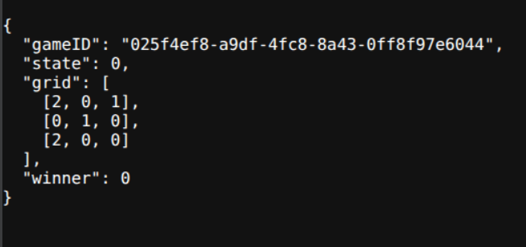

# TicTacToe
Implementation of simple web application - Tic Tac Toe game - in Golang using the net/http, gin and uber/fx

## Description
The application logic is divided into 4 layers: domain, datasource, web and di. Computer move logic implemented using Minimax algorithm.
Each game is represented by the following structure:  
```golang
type Game struct {
	Grid   Grid      // Current state of the board - matrix with players marks (Cross and Nought)
	ID     uuid.UUID // Unique identifier of the game
	State  State     // Current state of the game
	Winner Mark      // The winner mark
}
```

## Features

Application allows to make the following requests:
- get list of all games;
- get game by id;
- make new game and move;
- make move in game by id;
- save all games from app to JSON file.

Examples for all requests given in `request/example.http`.

Response to game state request by game uuid:



## Dependencies

* Golang >= 1.22.0
* Makefile
* uber/fx
* gin

## Building project
`make init`  
`make run`
